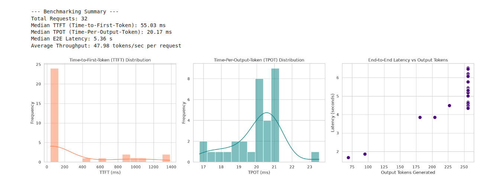
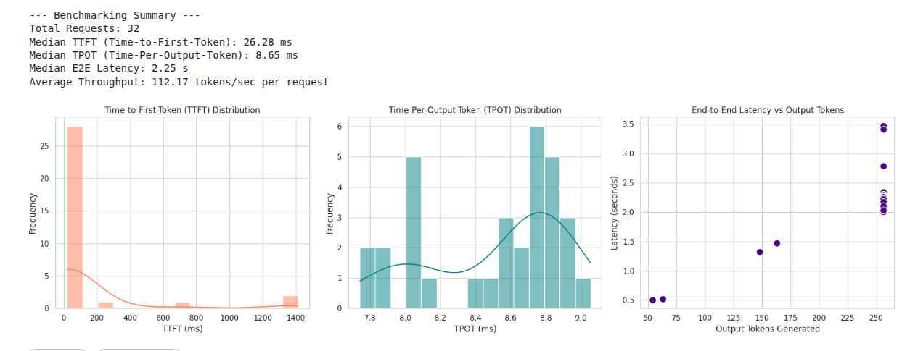

# Async LLM Benchmarking: Qwen-1.5B

A lightweight, asynchronous Python tool for profiling LLM serving performance using vLLM. 

I built this to benchmark the base `Qwen2-1.5B-Instruct` (FP16) model against a pre-quantized 4-bit AWQ version (`Qwen2.5-1.5B-Instruct-AWQ`) to measure the exact impact of quantization on memory bandwidth and latency bottlenecks.

## The Setup

Instead of uniform batching, this script uses a Poisson distribution to simulate unpredictable user traffic at a target of 4 Requests Per Second (QPS). 

Metrics tracked:
* **TTFT (Time-to-First-Token):** Engine responsiveness / queueing delay.
* **TPOT (Time-Per-Output-Token):** Inter-token latency during the decoding phase.
* **E2E Latency:** Total request time for a max 256-token generation.

## Results

Running the benchmark across 32 requests at 4 QPS highlighted the severe memory bandwidth bottleneck in the FP16 model, and how AWQ quantization resolves it. 

| Metric | Qwen2-1.5B (FP16) | Qwen2.5-1.5B (4-bit AWQ) | Delta |
| :--- | :--- | :--- | :--- |
| **Median TTFT** | 55.03 ms | 26.28 ms | 2.1x faster |
| **Median TPOT** | 20.17 ms | 8.65 ms | 2.3x faster |
| **Median E2E Latency** | 5.36 s | 2.25 s | 2.4x faster |
| **Throughput** | 47.98 tokens/s | 112.17 tokens/s | +133% |

**Takeaways:**
1. By compressing the weights to 4-bit, the GPU transfers data from VRAM to compute cores much faster. This cut the decoding latency (TPOT) from **~20ms down to ~8.6ms**, yielding a 2.3x throughput increase under load without changing the hardware.
2. Under overlapping Poisson traffic spikes, vLLM utilizes continuous batching to dynamically group incoming prompts into active iteration cycles. This architecture ensures that inter-token latency (TPOT) remains tightly grouped and stable, peaking consistently at ~8.6ms for AWQ even when there is a spike in concurrent requests.
3. While decoding latency stays stable under load, traffic spikes will temporarily saturate engine capacity. When this happens, new requests sit in the vLLM queue. This creates a clear long-tail distribution in the TTFT graphs: the baseline response is sub-100ms, but requests caught in a burst face queueing delays that push TTFT past 1000ms before the prefill phase even starts.

## Visualizations

### Base Model Performance (Qwen2-1.5B-Instruct FP16)

### Quantized Model Performance (Qwen2.5-1.5B-Instruct-AWQ)

## Running It Locally

**Prerequisites:**
* Python 3.10+
* NVIDIA GPU
* `vLLM` installed

